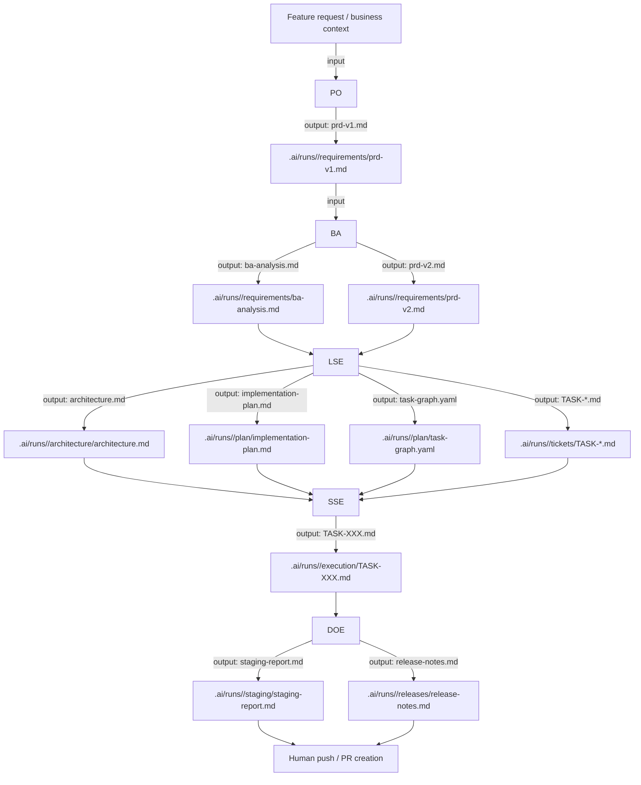

# Agents Registry

This registry references the reusable role-based agents used in the autonomous workflow.

## Agent map

### PO

- Agent file: `agents/po.md`
- Skill used: `product-requirements`
- Primary output: `.ai/runs/<RUN_ID>/requirements/prd-v1.md`
- Role: create the initial product requirement document from the feature request

### BA

- Agent file: `agents/ba.md`
- Skill used: `requirements-analysis`
- Primary outputs:
  - `.ai/runs/<RUN_ID>/requirements/ba-analysis.md`
  - `.ai/runs/<RUN_ID>/requirements/prd-v2.md`
- Role: analyze and refine business requirements for engineering readiness

### LSE

- Agent file: `agents/lse.md`
- Skill used: `task-planning`
- Primary outputs:
  - `.ai/runs/<RUN_ID>/architecture/architecture.md`
  - `.ai/runs/<RUN_ID>/plan/implementation-plan.md`
  - `.ai/runs/<RUN_ID>/plan/task-graph.yaml`
  - `.ai/runs/<RUN_ID>/tickets/TASK-*.md`
- Role: design the architecture and break work into executable tickets

### SSE

- Agent file: `agents/sse.md`
- Skill used: `typescript`, `express`, `testing`, `code-review`
- Primary output: `.ai/runs/<RUN_ID>/execution/TASK-XXX.md`
- Role: implement code for each task, write tests, and validate TypeScript quality gates

### DOE

- Agent file: `agents/doe.md`
- Skill used: `docker`, `kubernetes`, `release-notes`
- Primary outputs:
  - `.ai/runs/<RUN_ID>/staging/staging-report.md`
  - `.ai/runs/<RUN_ID>/releases/release-notes.md`
- Role: validate staging readiness, run operational checks, and prepare final release handoff

## Agent contract pattern

Each agent file should contain:

- YAML frontmatter with `name` and `description`
- clear responsibility statement
- expected inputs and outputs
- workflow rules and quality gates
- detection/trigger phrases for invocation
- escalation conditions when work is blocked

## Workflow sequence

This is the operating contract for the autonomous development environment.

## Manual CLI sequence (tuning mode)

During early testing and prompt tuning, stages are triggered manually one-by-one from the command line:

1. `node dist/main.js start --feature-request ../path/to/feature-request.md`
2. `node dist/main.js start --business-analysis ../path/to/prd-v1.md`
3. `node dist/main.js start --technical-documentation ../path/to/prd-folder`
4. `node dist/main.js start --technical-implementation ../path/to/technical-folder`

This mode intentionally avoids automatic stage chaining so each role can be validated independently.
